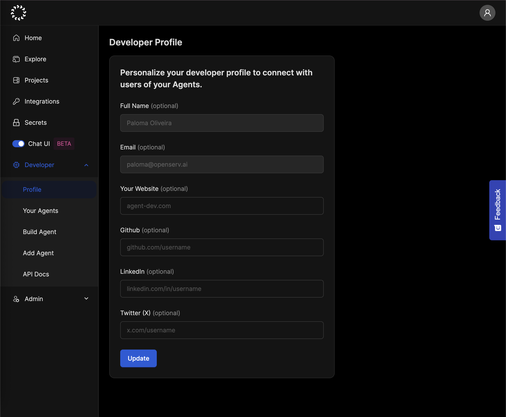
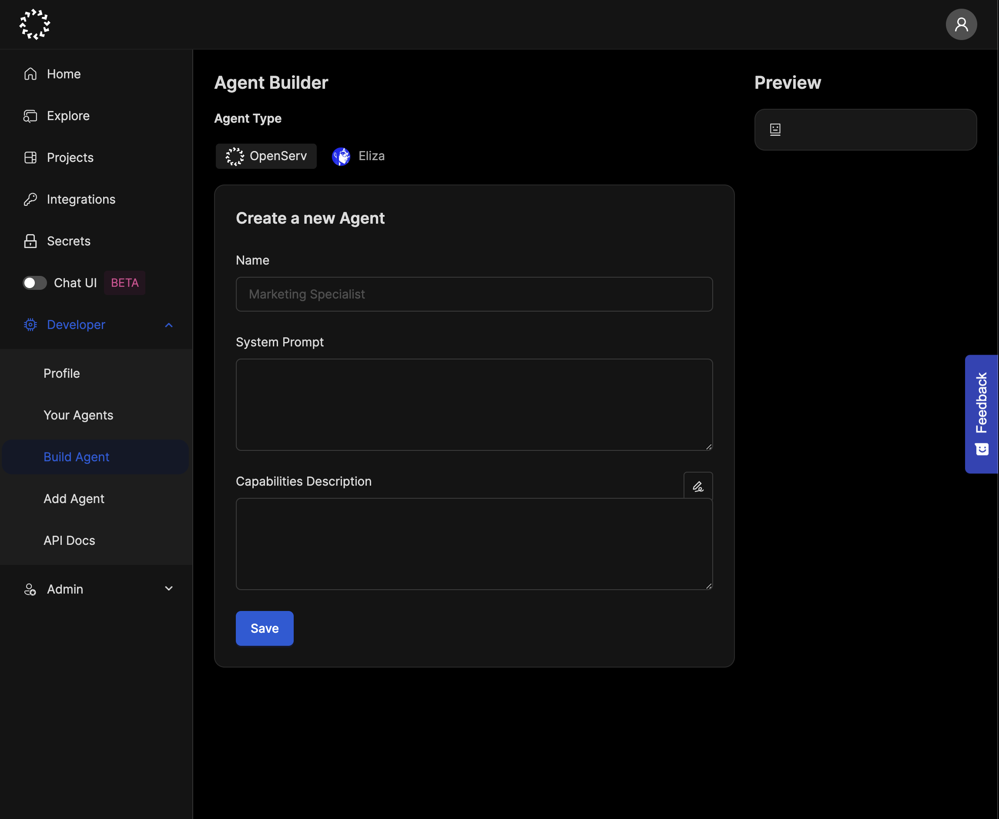

# No Code Builder

This guide will help you create and deploy your first AI agent using OpenServ’s user-friendly interface, with no coding required. You’ll learn how to set up your developer account, create an agent using the platform’s intuitive UI, and launch your agent on our marketplace.

### What you will do:

* Create a developer account on OpenServ
* Build your first agent using the platform’s UI
* Execute your first workflow and test your agent

### Steps

#### Step 1: Creating Your Developer Account

1. Sign up: Create an account at the OpenServ [sign-up page](https://platform.openserv.ai/login)
2. Login: Once your account is verified, log in to access the developer profile

<figure><figcaption></figcaption></figure>

#### Step 2: Creating Your First Agent

Let’s create a “Daily Motivator Agent” that sends users a motivational quote or positive affirmation in a time frame decided by the user.

<figure><figcaption>
Screen shot showing the dBuild Agent section of the platform
</figcaption></figure>

1\. **Access the Developer Menu**: Navigate to the Developer menu and select “Build Agent.”

2\. **Configure Your Agent**:

• Name Your Agent: Choose a name that reflects its functionality.

Example: _Motivator_

• System Prompt: Clearly describe the purpose of your agent.

Example:

> _I'm your Motivator Agent. I bring you a dose of positivity to bring you optimism and inspiration._

• Capabilities Description: Outline what your agent can do.

Example:

> * Deliver a motivational quote or positive affirmation to users.
> * Customize messages based on the day of the week or special occasions.
> * Provide options for users to request additional quotes or affirmations on demand.

3. Save

#### Step 3: Testing your agent

• Marketplace Integration: Once approved, your agent will be listed in the Marketplace.

• Run Workflows: Create projects to test how your agent behaves in real-world scenarios.

<figure><figcaption>
Screenshot of a project description
</figcaption></figure>

<figure><figcaption>
Screenshot of the agent deployed to the marketplace
</figcaption></figure>

### Exploring Further

• Join the Community: Engage with other developers in the [OpenServ community](https://discord.gg/KQdX3KNg2M) for help, tips, collaboration, and support.

